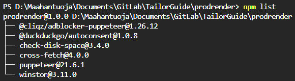
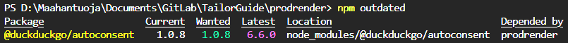

# Product Renderer Documentation

<!-- ###### last update 11.1.2024 -->

### Introduction

Product Renderer is a cross platform utility tool developed by **Jarmo Vuorinen**. Program is a web scraping tool built with Node.js and Puppeteer.

It uses Puppeteer library to control headless Chrome browser, Winston for logging information, errors, and other messages throughout the application and various other libraries. It is designed to navigate a list of web pages, capture screenshots, extract html and text content, and save any wanted images found on the page. It includes features ad blocking and cookie consent bypassing techniques. It also handles other popups such as language and region selections, newsletter subscription and lazy-loaded content to ensure clean page captures.

Product Renderer is a powerful and robust tool for web scraping. It is highly customizable and can be adapted to suit various needs.

## Table of Contents 

- [Introduction](#introduction)
- [Table of Contents](#table-of-contents)
- [Key Features](#key-features)
- [Configuration](#configuration)
  - [Paths](#paths)
  - [Files](#files)
  - [Variables](#variables)
  - [Patterns](#patterns)
  - [Selectors](#selectors)
  - [Web Pages](#web-pages)
- [Modules](#modules)
  - [Logger](#logger)
  - [Data](#data)
  - [Utilities](#utilities)
  - [Navigation](#navigation)
  - [Image Processing](#image-processing)
- [Error Handling](#error-handling)
- [Getting Started](#getting-started)
  - [Prerequisites](#prerequisites)
  - [Installing Node.js and NPM](#installing-nodejs-and-npm)
  - [Dependencies](#dependencies)
  - [Usage](#usage)
- [Help](#help)
  - [Update Package \& Dependencies](#update-package--dependencies)
  - [Troubleshooting](#troubleshooting)
  - [Potential Bugs and Issues](#potential-bugs-and-issues)
  - [Limitations](#limitations)
  - [TODOs](#tods)

## Key Features

- **Webpage Scraping**: This program is designed to scrape webpages, capturing screenshots, extracting html and text content, and downloading all images.

- **Lazy-loaded Page Handling**: Program includes an auto-scroll function to ensure all content on a lazy-loaded page is loaded before capturing a screenshot.

- **Cookie handling**: Program uses a combination of the @duckduckgo/autoconsent library, @cliqz/adblocker-puppeteer library and custom logic to automatically handle cookies and other popups on most of sites.

- **Image extraction**: The application listens for image responses and saves all images from the page (excluding certain patterns defined in the config.json file).

- **HTML and text extraction**: The application extracts the full HTML content and the text content of the page.

- **Data consolidation**: All collected data (screenshot path, image urls, html content, and text content) is consolidated into single json file.

- **Disk Space Check**: The script checks for available disk space before starting the program, ensuring there's enough space for the output files.

- **Auto update**: Program checks for outdated npm packages and update them if necessary, this feature can be controlled on/off from configs, and updater can be used manually as well.

- **Configurable**: Program is highly configurable, allowing users to specify the urls to be scraped, output paths, delay times, viewport sizes, and more in a configuration file.

- **Error Handling**: The program includes error handling for each function and logs errors to a specified log file.

<div align = 'right'>

[Back to top &uarr;](#product-renderer-documentation)

</div>

## Configuration

The `config.json` file is a crucial part of the Product Renderer application. It provides a centralized place to manage configurations, variables, and other settings used by the application.

Here's a breakdown of the different sections in the config file:

### Files

This section defines the names of the output files.

- `consolidatedDataJson`: The name of the JSON file where the consolidated data will be stored.
- `dataJson`: The name of the JSON file where the extracted HTML and text content will be stored.

### Paths

This section contains the paths for various directories and files used by the program.

- `outputDriver`: The drive where the output data will be stored.
- `addon`: The path to the browser extension used by Puppeteer.
- `appLog`: The relative path to the folder where the application's log file will be stored.
- `outputFolder`: The relative path to the folder where the output data will be stored.
- `outputImages`: The relative path to the folder where the extracted images will be stored.
- `outputData`: The relative path to the folder where the extracted HTML and text content will be stored.

### Patterns

This section contains a list of regular expressions used to filter out certain images and accepting cookies from the page.

- `excludedPatterns`: An array of patterns that will be excluded from the scraped data.
- `expectedTextPatterns`: A pattern that defines the expected text for accepting cookies on a webpage.

### Selectors

This section contains selectors used to find and click different elements on web pages.

- `cookieSelector`: Selector for cookie-related elements.
- `customSelector`: Selector for custom elements.
- `defaultSelector`: Default selector for general elements.

### Utils

This section configures utility-related settings.

- `updater`: Configuration for the auto-update feature.
  - `autoUpdate`: Set to true for enabling auto-update.
  - `cmdOutdated`: Command to check outdated dependencies.
  - `cmdUpdate`: Command to update dependencies.

### Variables

This section contains various settings for the program, such as timeout delays, viewport size, and the minimum disk space required to run the program.

- `bits`: The number of bits in a byte (used for converting disk space values).
- `captureDelay`: The delay (in milliseconds) before capturing the screenshot of the webpage.
- `cookieTimeOut`: The maximum time (in milliseconds) the application will wait for cookies to be blocked.
- `jsonIndentation`: The number of spaces used for indentation in the JSON output files.
- `minimumPercentage`: The minimum percentage of disk space that should be available for the application to run.
- `puppeteerMode`: Controls puppeteer headless mode, "new" for default use or false for debugging.
- `responseStatusCode`: The HTTP status code that the application will consider as a successful response.
- `rounded`: The number of decimal places for rounding disk space values.
- `scrollDelay`: The delay (in milliseconds) between scrolling page down and back to up to handle lazy loaded pages.
- `sliceAmount`: The number of characters to remove from the beginning of the error stack trace.
- `timeOutDelay`: The maximum time (in milliseconds) the application will wait for a webpage to load.
- `toMB and toGB`: The powers to raise the bits value to convert disk space values to megabytes and gigabytes, respectively.
- `viewportWidth and viewportHeight`: The dimensions of the viewport for the screenshot.

### Web Pages

This section contains an array of URLs that the application will scrape. This list can be modified to include any number of webpages.

<div align = 'right'>

[Back to top &uarr;](#product-renderer-documentation)

</div>

## Modules

The application is divided into several modules, each responsible for a specific task.

The `my-modules.js` file is a module that exports a collection of utilities, data processing functions, navigation functions, and image processing functions. It serves as a centralized location to import all the necessary modules needed for the web scraping program. 

The file is organized into several sections:

### Data

This section imports various data processing modules:

- `consolidateData`: Consolidates the scraped data into a single JSON file.
- `extractHtmlAndTxtContent`: Extracts html and text content from the webpage.
- `generateOutputPaths`: Generates the output paths for the image and data files.

### Image Processing

This section imports various image processing modules:

- `imageListener`: Sets up an image listener for the page.
- `imageResponses`: Captures images from the webpage.
- `takeScreenShot`: Takes a screenshot of the webpage.

### Navigation

This section imports various navigation modules:

- `navigateToUrl`: Navigates to a specific URL.
- `openNewPage`: Opens a new page in the Puppeteer browser.

### Utilities

This section imports various utility modules:

- `autoScroll`: Handles automatic scrolling of lazy loaded webpages.
- `checkDiskSpace`: Checks is enough disk space available.
- `clickOnElementWithText`: Clicks on an element with a specific text.
- `cookieBlocker`: Blocks cookies on the webpage.
- `delay`: Delay execution of the program.
- `launchPuppeteer`: Launches a new Puppeteer browser instance.
- `logger`: Logging information, errors, and other messages throughout the application.
- `runUpdater`: Checks for updates and installs them if any are available.

All these modules are then exported in an object, so they can be easily imported in other parts of the application.

<div align = 'right'>

[Back to top &uarr;](#product-renderer-documentation)

</div>

## Error Handling

The application includes error handling for each module. If an error occurs, it will be logged in the console and in the application's log file.

<div align = 'right'>

[Back to top &uarr;](#product-renderer-documentation)

</div>

## Getting Started

### Prerequisites

Before you begin, ensure you have the following installed on your computer:

- Node.js
- NPM (Node Package Manager)
- Git (optional)

To check if Node.js and NPM are installed on your computer, open your terminal or command prompt and type the following commands, if Node.js and NPM is installed, you will see the version numbers:

```sh
node -v
npm -v
```

### Installing Node.js and NPM

<details>

<summary>Windows & Mac</summary>

1. Download the Node.js installer from the [official Node.js website](https://nodejs.org/en/download/).
2. Run the installer (the .msi installer for Windows or the .pkg installer for Mac).
3. Follow the prompts in the installer. Make sure to select install npm as well, which is included with the Node.js distribution.

</details>

<details>

<summary>Linux</summary>

- For Linux, you can use a package manager like apt for Debian-based distributions.

Here are the commands for installing Node.js and npm using apt:

```sh
sudo apt update
sudo apt install nodejs npm
```

</details>

### Dependencies

1. Clone the repository or download the source code.

    If you have Git installed, you can clone the repository with the following command:

    ```sh
    git clone https://lab.aarila.com/crawler/prodrender.git
    ```

    If you don't have Git installed, you can download the source code directly from the repository's page on GitLab.

2. Navigate to the project directory

    ```sh
    cd prodrender
    ```

3. Install the project dependencies.
   
    ```sh
    npm install
    ```

### Usage

1. Update the config.json file with your desired configurations and the list of web pages to be rendered.

2. Run the program: Open terminal, go to the program src folder what contains index.js file and write following command.
   
    ```sh
    cd prodrender/src
    node index.js
    ```

3. The program will create an output directory for each url, containing a screenshot of the page, images from the page, and a json file with the html and text content of the page.
   
4. If any error occurs during the process, it will be logged in the console and in the application's log file.

<div align = 'right'>

[Back to top &uarr;](#product-renderer-documentation)

</div>

##  Help

### Update Package & Dependencies

- `npm list`: You can check your project's dependencies and their versions with this command.
  
  


- `npm outdated`: 
  This command will check every installed dependency and compare the current version with the latest version in the npm registry. It is printed out into a table outlining available versions.
  
  It is built into npm so there are no additional packages required to download. npm outdated is a good place to start for an overview of the number of dependency updates required.

  

  `Current` is the current version installed. 

  `Wanted` is the max version of the package according the semver range.

  `Latest` is the version of the package tagged as latest in the npm registry.

- `npm update`: Keep in mind that with npm update it will never update to a major breaking-changes version. It updates the dependencies in package.json and package-lock.json. It will use the "wanted" version.

- `npm instal package@latest`: To obtain the "latest" version append @latest to individual installs, for example: npm install duckduckgo/autoconsent@latest. This command forces the installation of the latest version, irrespective of the version numbers specified in the package.json file.
  
- Getting in the habit of regularly updating dependencies will help apps security and performance.

### Troubleshooting

If you encounter issues while using the program, here are some general troubleshooting steps you can follow:

1. `Check the Error Logs`: The application logs error messages in the console and in the application's log file. These logs can provide valuable information about what went wrong and help in troubleshooting.

2. `Verify Your Configurations`: Check your config.json file to ensure all configurations are correct. This includes the list of web pages, output directories, and excluded patterns for image extraction.
   
3. `Check Your Internet Connection`: Ensure that your internet connection is stable. Network issues can cause the application to timeout while loading web pages.
   
4. `Check Disk Space`: Make sure you have enough disk space available for the application to store the extracted data.
   
5. `Update Your Dependencies`: If you're seeing errors related to Puppeteer or other dependencies, try updating them to the latest version using npm update.

6. `Reinstall Node Modules`: If the problem persists, try deleting the node_modules folder and the package-lock.json file, then reinstall the dependencies using npm install.

7. `Check for Node.js and npm Updates`: Ensure that you are using the latest versions of Node.js and npm. You can update Node.js by downloading the latest version from the official website, and update npm using the command npm install -g npm.

If you're still experiencing issues after following these steps, consider seeking help from the developer or the community. When asking for help, provide a detailed description of the problem, the steps you've tried to resolve it, and any error messages or logs you have.

### Potential Bugs and Issues

While the Product Renderer is designed to be robust and efficient, there might be potential bugs or issues that could arise during usage. Here are some possible scenarios:

1. `Insufficient Disk Space`: The application checks for available disk space before starting the process. However, if the disk space runs out during execution, it could lead to incomplete data extraction or program failure.
   
2. `Timeout Errors`: While navigating to a URL or waiting for a page to load, the application might timeout if the page takes too long to respond. This could be due to network issues, server-side issues, or the page being too large.
   
3. `Incorrect URL`: If the URLs provided in the config.json file are incorrect or the web pages do not exist, the application will fail to navigate and extract data.
   
4. `Changes in Web Page Structure`: The application might fail to extract data if there are changes in the structure of the web pages. This is because the application depends on specific HTML elements to extract data.
   
5. `Blocked by Website`: Some websites might block the application from accessing their content due to the high number of requests or because they detect the application as a bot.

6. `Excluded Patterns Not Working`: The application uses regular expressions to exclude certain patterns during image extraction. If these regular expressions are not correctly formulated, they might not exclude the intended patterns.
   
7. `Puppeteer Launch Failure`: The Puppeteer library might fail to launch due to various reasons such as incompatible versions, missing dependencies, or system restrictions.

If you encounter any of these issues, or any other bugs, please report them to the developer so they can be addressed. Make sure to provide a detailed description of the issue, the steps to reproduce it, and any error messages or logs.

### Limitations

- The program currently only works with static sites. It will not work with sites that require user interaction to load content.

- The program may not be able to accept cookie banners on all sites. The success rate can be improved by adding more rules to the cookie and popup handling logics.

### Todo's & Future plans

- Due to the nature of some cookie consent dialogs, there might be cases where the dialog reappears even after being handled. Add a recheck mechanism to ensure the cookie banner has been completely dismissed before proceeding.

- Add a mechanism to detect lazy-loaded pages to avoid unnecessary page scrolling.

<div align = 'right'>

[Back to top &uarr;](#product-renderer-documentation)

</div>
